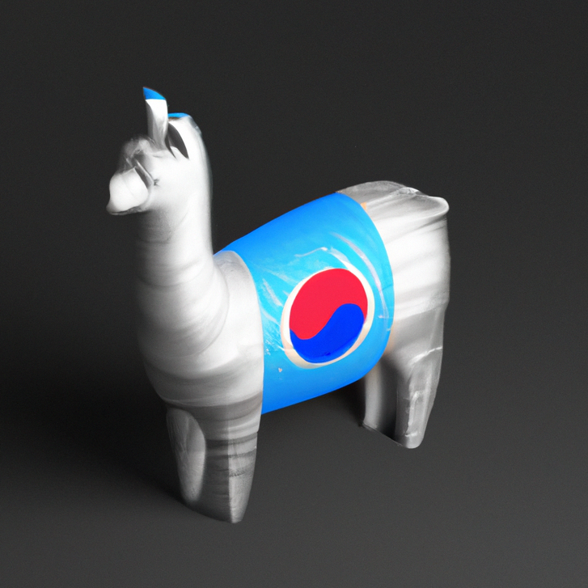
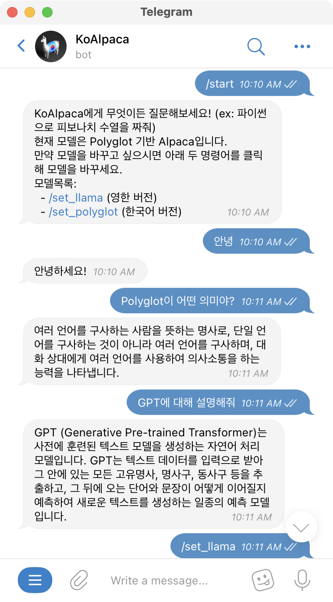
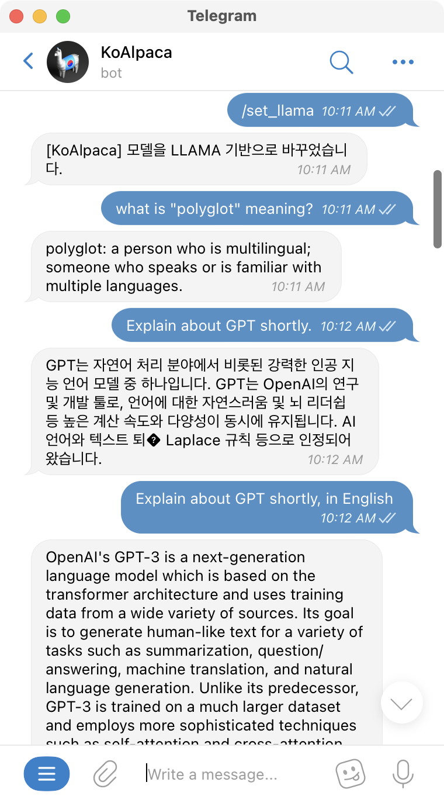
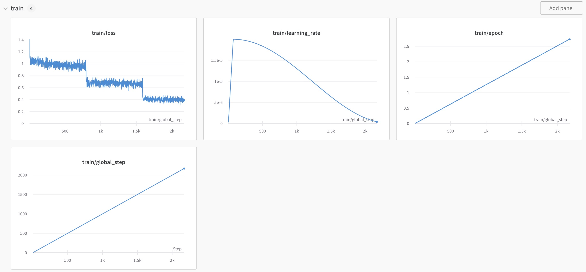

<p align="center" width="100%">

</p>

# KoAlpaca: Korean Alpaca Model based on Stanford Alpaca (feat. LLAMA and Polyglot-ko)

Stanford Alpaca 모델을 학습한 방식과 동일한 방식으로 학습을 진행한, 한국어 Alpaca 모델입니다.

## 바로 써보기: 카카오톡 봇 혹은 Telegram Bot으로 만나보세요!

### 카카오톡 봇: 한국어 전용 & 맥락 기억 X

링크: 아래 이미지 클릭 or [http://pf.kakao.com/_wdRxcxj](http://pf.kakao.com/_wdRxcxj)

<p align="center" width="100%">
<a href="http://pf.kakao.com/_wdRxcxj">

</a>
</p>


### 텔레그램 봇: 한국어 & 한국어+영어 모델 사용가능, 맥락 저장

아래 QR코드를 찍거나, 혹은 [https://t.me/KoAlpacaBot](https://t.me/KoAlpacaBot)에서 만나보세요!

<p align="center" width="100%">

</p>

한국어 모델과 영한 모델 모두 변경해가며 체험하실 수 있습니다!

<p align="center" width="100%">


</p>

> 📣 각 모델별 한 대의 GPU로 서빙되고 있어서, 생성에 시간이 걸릴 수 있습니다. 속도를 위해 생성 최대 토큰은 요청당 128토큰으로 제한되어있습니다.

## 완성된 모델: 한국어 모델(Polyglot-ko) & 영한 모델(LLAMA)

KoAlpaca는 백본 모델로 두 가지 모델을 사용했습니다.

1. Polyglot-ko 5.8B 기반 -> [https://huggingface.co/beomi/KoAlpaca-Polyglot](https://huggingface.co/beomi/KoAlpaca-Polyglot)
2. Meta LLAMA 7B 기반 -> [https://huggingface.co/beomi/KoAlpaca](https://huggingface.co/beomi/KoAlpaca)

Meta의 LLAMA 모델은 한국어 데이터셋을 충분히 학습하지 않아서, 실제 Inference를 돌려보았을 때 한국어 성능이 낮게 나오는 이슈가 있습니다.

보다 한국어에 나은 퀄리티를 얻어보고자 Polyglot-ko 5.8B 모델을 백본으로 사용한 두 가지 모델을 학습시켰습니다.

## LLAMA 모델 Inference 예시 코드

[Inference Test.ipynb](Inference%20Test.ipynb) 파일을 참고해주세요.

## 데이터셋 제작 방법

데이터셋은 기본적으로 [Stanford Alpaca에서 제공한 5만2천개 데이터셋](./en_alpaca_data.json)을 기반으로 합니다.

1. 데이터셋 번역

Alpaca 데이터셋은 다음과 같이 Instruct 부분과 Input, 그리고 Output 부분으로 구성되어있습니다.

```json
...
{
    "instruction": "Describe a time when you had to make a difficult decision.",
    "input": "",
    "output": "I had to make a difficult decision when I was working as a project manager at a construction company. I was in charge of a project that needed to be completed by a certain date in order to meet the client\u2019s expectations. However, due to unexpected delays, we were not able to meet the deadline and so I had to make a difficult decision. I decided to extend the deadline, but I had to stretch the team\u2019s resources even further and increase the budget. Although it was a risky decision, I ultimately decided to go ahead with it to ensure that the project was completed on time and that the client\u2019s expectations were met. The project was eventually successfully completed and this was seen as a testament to my leadership and decision-making abilities."
},
{
    "instruction": "Identify the odd one out.",
    "input": "Twitter, Instagram, Telegram",
    "output": "Telegram"
},
...
```

Output의 경우 OpenAI의 `text-davinci-003` 모델의 생성 결과이기 때문에, 해당 부분은 번역하지 않았습니다.

따라서 Instruct와 Input 컬럼을 번역하고, 해당 Input부분에 에러가 있는 일부를 제외하였습니다.

번역을 하기 위해 DeepL API 서비스를 사용하였고, 번역된 데이터는 다음과 같은 형태가 됩니다.

```json
...
{
    "instruction": "홀수 중 하나를 밝히세요.",
    "input": "트위터, 인스타그램, 텔레그램"
}
...
```

2. Output 데이터 생성

이후 해당 Instruct와 Input은 다음과 같이 Batch Decoding 기법을 통해서 OpenAI ChatGPT API(`gpt-3.5-turbo`)를 통해 데이터를 생성합니다. 

Alpaca 연구와 동일하게, 한 Instruct/Input 셋에 대해서 단일 응답만을 생성해 데이터셋을 구성하였습니다.

기존 연구에서는 20개의 데이터셋을 한번에 생성했지만, 한국어로 생성을 진행해보았을 때 10개를 동시에 생성할 때 안정적으로 생성이 진행되어 10개씩 생성하였습니다.

아래는 답변을 생성하는데 사용한 Prompt입니다.

```python
PROMPT = """\
다양한 작업에 대한 답변을 생성해주세요. 이러한 작업 지침은 ChatGPT 모델에 주어지며, ChatGPT 모델이 지침을 완료하는지 평가합니다.

요구 사항은 다음과 같습니다:
1. 다양성을 극대화하기 위해 각 지시에 대해 동사를 반복하지 않도록 하세요.
2. 지시에 사용되는 언어도 다양해야 합니다. 예를 들어, 질문과 명령형 지시를 결합해야 합니다.
3. 지시 사항의 유형이 다양해야 합니다. 목록에는 개방형 생성, 분류, 편집 등과 같은 다양한 유형의 작업이 포함되어야 합니다.
2. GPT 언어 모델은 지시를 완료할 수 있어야 합니다. 예를 들어 어시스턴트에게 시각적 또는 오디오 출력을 생성하도록 요청하지 마세요. 또 다른 예로, 어시스턴트가 어떤 작업도 수행할 수 없으므로 오후 5시에 깨우거나 미리 알림을 설정하도록 요청하지 마세요.
3. 답변은 한국어로 작성해야 합니다.
4. 답변을 1~2문장으로 작성하세요. 명령문이나 질문도 허용됩니다.
5. 지시 사항에 대한 적절한 입력을 생성해야 합니다. 입력 필드에는 지시에 대한 구체적인 예가 포함되어야 합니다. 실제 데이터를 포함해야 하며 단순한 자리 표시자를 포함해서는 안 됩니다. 입력은 지시 사항을 어렵게 만들 수 있는 상당한 내용을 제공해야 하지만 100단어를 넘지 않는 것이 이상적입니다.
6. 일부 지시사항은 추가 입력이 있고, 일부 지시에는 입력 필드가 비어있습니다. 예를 들어 "세계에서 가장 높은 봉우리는 무엇인가?"라는 일반적인 정보를 묻는 지시의 경우 구체적인 맥락을 제공할 필요가 없어, 입력 필드가 비어있을 수 있습니다.
7. 출력은 명령어와 입력에 대한 적절한 응답이어야 합니다.

아래에 10개의 명령어와 입력(옵션)에 따라 적절한 응답을 생성하세요. 
응답은 아래와 같은 형식으로 10가지를 0번 부터 9번 까지, 번호에 따라 해당 번호의 명령어와 입력에 알맞게 작성하세요.

각 응답 사이는 ### 으로 내용을 분리해주세요.

응답0: 첫 번째 응답내용###
응답1: 두 번째 응답내용###
...
응답9: 마지막 응답내용"""
```

추가적으로, 아래와 같이 ChatGPT API의 system prompt를 추가하였습니다.

```python
"content": "아래는 작업을 설명하는 명령어입니다. 입력이 없으면 입력을 제외하고, 명령어에 따른 요청을 적절히 완료하는 응답을 작성하세요. 추가적 입력이 있다면 작업을 설명하는 명령어와 추가 컨텍스트를 제공하는 입력에 따라 요청을 적절히 완료하는 응답을 작성하세요.",
```

한국어로 생성이 완료된 데이터셋은 `ko_alpaca_data.json`에 저장되어 있습니다.

## 모델 학습 방법

### LLAMA 7B 모델 학습



모델 학습은 A100 80GB 4대로 학습을 진행하였습니다. 학습에 사용한 스크립트는 `train.py`에 저장되어 있고, 학습에 사용한 스크립트는 `train.sh`에 저장되어 있습니다.

#### 모델 학습시 유의사항

아래에도 적혀있지만, 현재(2023.03.18기준) LLAMA 모델은 Huggingface `main` 브랜치에만 있습니다. 또한, Layer 명칭이 지속적으로 바뀌고 있어 주의가 필요합니다. 현재는 `LlamaDecoderLayer`로 되어있습니다.

```bash
# train.sh
--fsdp_transformer_layer_cls_to_wrap 'LlamaDecoderLayer'
```

### Polyglot-ko 5.8B 모델 학습

모델 학습은 A100 80GB 1대로 학습을 진행하였습니다. 

*내용보충 예정

## NSMC Benchmark Test

<a target="_blank" href="https://colab.research.google.com/github/Beomi/KoAlpaca/blob/master/nsmc_polyglot_and_koalpaca_by_few_shot.ipynb">
  
</a>

### Benchmark Test 방식

- `polyglot-ko 5.8b`와 `KoAlpaca-polyglot`과 Benchmark 성능 비교
- Few-shot Learning으로 2 가지 프롬프트 유형으로 구분하여 테스트 진행

#### 1. Few-shot Learning 구성

- few-shot 구성
  - `k=10` 설정
  - 텍스트 토큰 길이가 25 이하인 문장만 구성
  - 데이터 토큰 길이의 약 75 퍼센타일에 해당하는 데이터만 포함

- NSMC 데이터 토큰 길이 분포

```
Few shot 케이스 토큰 평균 길이:  20.229
Few shot 케이스 토큰 최대 길이:  280
Few shot 케이스 토큰 길이 표준편차:  16.488
Few shot 케이스 토큰 길이 80 퍼센타일:  27.0
```

#### 2. 프롬프트 구성

- 프롬프트 유형 1: 매우 단순한 프롬프트 구성. 분석 Task에 대한 내용을 명시적으로 하지 않음
```python
def build_prompt_text(sent):
    return "문장: " + sent + '\n감정:'
```

- 프롬프트 유형 2: 프롬프트 유형 1에 비해 Task 의도 내용을 포함. 분석 Task에 대한 내용을 의문형으로 표현
```python
def build_prompt_text(sent):
    return '다음 문장은 긍정일까요 부정일까요?\n' + sent + '\n정답:'
```

#### 3. Benchmark Test 결과

 acc. | 프롬프트 유형 1 | 프롬프트 유형 2
-- | -- | --
polyglot-ko | 0.5752 | 0.7223
**koalpaca-polyglot** | **0.6939** | **0.7683**

---

## Stanford Alpaca: An Instruction-following LLaMA Model 
[](https://github.com/tatsu-lab/stanford_alpaca/blob/main/LICENSE) 
[](https://www.python.org/downloads/release/python-390/) 
[](https://github.com/psf/black) 

This is the repo for the Stanford Alpaca project, which aims to build and share an instruction-following LLaMA model. The repo contains:
- A [**web demo**](https://crfm.stanford.edu/alpaca/) to interact with our Alpaca model
- The [52K data](#data-release) used for fine-tuning the model
- The code for [generating the data](#data-generation-process)
- The code for [fine-tuning the model](#fine-tuning)

## Overview

The current Alpaca model is fine-tuned from a 7B LLaMA model [1] on 52K instruction-following data generated by the techniques in the Self-Instruct [2] paper, with some modifications that we discuss in the next section.
In a preliminary human evaluation, we found that the Alpaca 7B model behaves similarly to the `text-davinci-003` model on the Self-Instruct instruction-following evaluation suite [2].

Alpaca is still under development, and there are many limitations that have to be addressed.
Importantly, we have not yet fine-tuned the Alpaca model to be safe and harmless.
We thus encourage users to be cautious when interacting with Alpaca, and to report any concerning behavior to help improve the safety and ethical considerations of the model.

Our initial release contains the data generation procedure, dataset, and training recipe. We intend to release the model weights if we are given permission to do so by the creators of LLaMA. For now, we have chosen to host a live demo to help readers better understand the capabilities and limits of Alpaca, as well as a way to help us better evaluate Alpaca's performance on a broader audience.

**Please read our release [blog post](https://crfm.stanford.edu/2023/03/13/alpaca.html) for more details about the model, our discussion of the potential harm and limitations of Alpaca models, and our thought process for releasing a reproducible model.**


[1]: LLaMA: Open and Efficient Foundation Language Models. Hugo Touvron, Thibaut Lavril, Gautier Izacard, Xavier Martinet, Marie-Anne Lachaux, Timothée Lacroix, Baptiste Rozière, Naman Goyal, Eric Hambro, Faisal Azhar, Aurelien Rodriguez, Armand Joulin, Edouard Grave, Guillaume Lample. https://arxiv.org/abs/2302.13971v1

[2]: Self-Instruct: Aligning Language Model with Self Generated Instructions. Yizhong Wang, Yeganeh Kordi, Swaroop Mishra, Alisa Liu, Noah A. Smith, Daniel Khashabi, Hannaneh Hajishirzi. https://arxiv.org/abs/2212.10560


## Data Release
[`alpaca_data.json`](./alpaca_data.json) contains 52K instruction-following data we used for fine-tuning the Alpaca model.
This JSON file is a list of dictionaries, each dictionary contains the following fields:
- `instruction`: `str`, describes the task the model should perform. Each of the 52K instructions is unique.
- `input`: `str`, optional context or input for the task. For example, when the instruction is "Summarize the following article", the input is the article. Around 40% of the examples have an input.
- `output`: `str`, the answer to the instruction as generated by `text-davinci-003`.

We used the following prompts for fine-tuning the Alpaca model:
- for examples with a non-empty input field:
 ```
 Below is an instruction that describes a task, paired with an input that provides further context. Write a response that appropriately completes the request.
 
 ### Instruction:
 {instruction}
 
 ### Input:
 {input}
 
 ### Response:
 ```
- for examples with an empty input field:
 ```
 Below is an instruction that describes a task. Write a response that appropriately completes the request.
 
 ### Instruction:
 {instruction}
 
 ### Response:
 ```
 
 During inference (eg for the web demo), we use the user instruction with an empty input field (second option).

## Data Generation Process

<details>
<summary> <strong> Running the code </strong> </summary>

1. Set environment variables `OPENAI_API_KEY` to your OpenAI API key.
2. Install the dependencies with `pip install -r requirements.txt`.
3. Run `python -m generate_instruction generate_instruction_following_data` to generate the data.

</details>

We built on the data generation pipeline from [self-instruct](https://github.com/yizhongw/self-instruct) and made the following modifications:
- We used `text-davinci-003` to generate the instruction data instead of `davinci`.
- We wrote a new prompt (`prompt.txt`) that explicitly gave the requirement of instruction generation to `text-davinci-003`. Note: there is a slight error in the prompt we used, and future users should incorporate the edit in https://github.com/tatsu-lab/stanford_alpaca/pull/24
- We adopted much more aggressive batch decoding, i.e., generating 20 instructions at once, which significantly reduced the cost of data generation.
- We simplified the data generation pipeline by discarding the difference between classification and non-classification instructions.
- We only generated a single instance for each instruction, instead of 2 to 3 instances as in [1].

This produced an instruction-following dataset with 52K examples obtained at a much lower cost (less than $500). 
In a preliminary study, we also find our 52K generated data to be much more diverse than the data released by [self-instruct](https://github.com/yizhongw/self-instruct/blob/main/data/seed_tasks.jsonl).
We plot the below figure (in the style of Figure 2 in the [self-instruct paper](https://arxiv.org/abs/2212.10560) to demonstrate the diversity of our data.
The inner circle of the plot represents the root verb of the instructions, and the outer circle represents the direct objects.

[//]: # (![parse_analysis]&#40;assert/parse_analysis.png | width=100&#41;)
[](./assets/parse_analysis.png)

## Fine-tuning
We fine-tune our models using standard Hugging Face training code with the following hyperparameters:

| Hyperparameter | Value |
|----------------|-------|
| Batch size     | 128   |
| Learning rate  | 2e-5  |
| Epochs         | 3     |
| Max length     | 512   |
 | Weight decay   | 0     |

Given Hugging Face hasn't officially supported the LLaMA models, we fine-tuned LLaMA with Hugging Face's transformers library by installing it from a particular fork (i.e. this [PR](https://github.com/huggingface/transformers/pull/21955) to be merged).
The hash of the specific commit we installed was `68d640f7c368bcaaaecfc678f11908ebbd3d6176`.

To reproduce our fine-tuning runs for LLaMA, first install the requirements 
```bash
pip install -r requirements.txt
```
Then, install the particular fork of Hugging Face's transformers library.

Below is a command that fine-tunes LLaMA-7B with our dataset on a machine with 4 A100 80G GPUs in FSDP `full_shard` mode. 
We were able to reproduce a model of similar quality as the one we hosted in our demo with the following command using **Python 3.10**.
Replace `<your_random_port>` with a port of your own, `<your_path_to_hf_converted_llama_ckpt_and_tokenizer>` with the 
path to your converted checkpoint and tokenizer (following instructions in the PR), and `<your_output_dir>` with where you want to store your outputs.

```bash
torchrun --nproc_per_node=4 --master_port=<your_random_port> train.py \
    --model_name_or_path <your_path_to_hf_converted_llama_ckpt_and_tokenizer> \
    --data_path ./alpaca_data.json \
    --bf16 True \
    --output_dir <your_output_dir> \
    --num_train_epochs 3 \
    --per_device_train_batch_size 4 \
    --per_device_eval_batch_size 4 \
    --gradient_accumulation_steps 8 \
    --evaluation_strategy "no" \
    --save_strategy "steps" \
    --save_steps 2000 \
    --save_total_limit 1 \
    --learning_rate 2e-5 \
    --weight_decay 0. \
    --warmup_ratio 0.03 \
    --lr_scheduler_type "cosine" \
    --logging_steps 1 \
    --fsdp "full_shard auto_wrap" \
    --fsdp_transformer_layer_cls_to_wrap 'LLaMADecoderLayer' \
    --tf32 True
```

### Warning
`fsdp_transformer_layer_cls_to_wrap` must be set to the name of the specific decoder layer. 
The LLaMA Hugging Face PR is not stable. 
Earlier commits used the name `LLaMADecoderLayer` for their decoder layer (the commit hash our code is based on this). 
More recent commits use `LlamaDecoderLayer` (notice the small case difference).
Not setting `fsdp_transformer_layer_cls_to_wrap` to the correct name will lead to drastic slowdowns in training.

### Side notes

The same script also works for OPT fine-tuning. Here's an example for fine-tuning OPT-6.7B

```bash
torchrun --nproc_per_node=4 --master_port=<your_random_port> train.py \
    --model_name_or_path "facebook/opt-6.7b" \
    --data_path ./alpaca_data.json \
    --bf16 True \
    --output_dir <your_output_dir> \
    --num_train_epochs 3 \
    --per_device_train_batch_size 4 \
    --per_device_eval_batch_size 4 \
    --gradient_accumulation_steps 8 \
    --evaluation_strategy "no" \
    --save_strategy "steps" \
    --save_steps 2000 \
    --save_total_limit 1 \
    --learning_rate 2e-5 \
    --weight_decay 0. \
    --warmup_ratio 0.03 \
    --lr_scheduler_type "cosine" \
    --logging_steps 1 \
    --fsdp "full_shard auto_wrap" \
    --fsdp_transformer_layer_cls_to_wrap 'OPTDecoderLayer' \
    --tf32 True
```

Note the given training script is meant to be simple and easy to use, and is not particularly optimized.
To run on more gpus, you may prefer to turn down `gradient_accumulation_steps` to keep a global batch size of 128. Global batch size has not been tested for optimality.

### Authors
All grad students below contributed equally and the order is determined by random draw.

- [Rohan Taori](https://www.rohantaori.com/)
- [Ishaan Gulrajani](https://ishaan.io/)
- [Tianyi Zhang](https://tiiiger.github.io/)
- [Yann Dubois](https://yanndubs.github.io/)
- [Xuechen Li](https://www.lxuechen.com/)

All advised by [Tatsunori B. Hashimoto](https://thashim.github.io/). Yann is also advised by [Percy Liang](https://cs.stanford.edu/~pliang/) and Xuechen is also advised by [Carlos Guestrin](https://guestrin.su.domains/).

### Citation

Please cite the repo if you use the data or code in this repo.
```
@misc{alpaca,
  author = {Rohan Taori and Ishaan Gulrajani and Tianyi Zhang and Yann Dubois and Xuechen Li and Carlos Guestrin and Percy Liang and Tatsunori B. Hashimoto },
  title = {Stanford Alpaca: An Instruction-following LLaMA model},
  year = {2023},
  publisher = {GitHub},
  journal = {GitHub repository},
  howpublished = {\url{https://github.com/tatsu-lab/stanford_alpaca}},
}
```

Naturally, you should also cite the original LLaMA paper [1] and the Self-Instruct paper [2].

### Acknowledgements

We thank Yizhong Wang for his help in explaining the data generation pipeline in Self-Instruct and providing the code for the parse analysis plot.
We thank Yifan Mai for helpful support, and members of the Stanford NLP Group as well as the Center for Research on Foundation Models (CRFM) for their helpful feedback.
